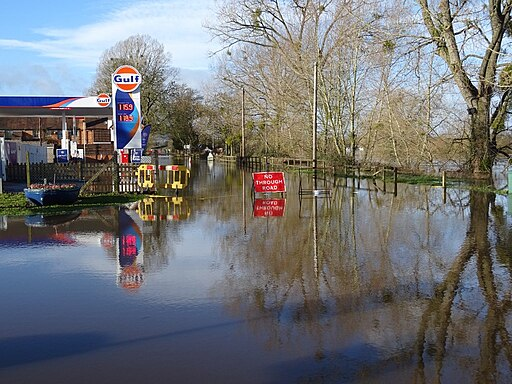

# Model Card for granite-geospatial-flood-detection-uki

This is a fine-tuned geospatial foundation model for detecting flood and surface water in the United Kingdom and Ireland using multispectral and synthetic aperture radar (SAR) satellite imagery. 

The model predicts areas of water from Sentinel-2 and Sentinel-1 SAR imagery and was trained on flood events from the United Kingdom and Ireland, recorded by the [Copernicus Emergency Management service (CEMS)](https://emergency.copernicus.eu/). Please see the [model description](#model-description) and [training Data](#training-data) below for more details. The model was fine-tuned from the [granite-geospatial-uki model](granite-geospatial-uki-model-card.md), which has also been released. 

You can use granite-geospatial-flood-detection-uki to run inference and detect flood events. Our experiments have shown that while granite-geospatial-flood-detection-uki works best in the UK and Ireland, the base model [granite-geospatial-uki](./granite-geospatial-uki-model-card.md) can also be successfully fine-tuned for flood detection in other locations. Please see the [granite-geospatial-uki model card](./granite-geospatial-uki-model-card.md) for details.

<figure>
    
    <figcaption>Flooding on Hanley Road by Philip Halling, CC BY-SA 2.0 <https://creativecommons.org/licenses/by-sa/2.0>, via Wikimedia Commons
    </figcaption>
</figure>

## How to Get Started with the Model 

1. [Inference notebook](./notebooks/1_getting_started.ipynb), for running the granite-geospatial-flood-detection-uki model.

2. [Fine-tuning](./notebooks/2_fine_tuning.ipynb) notebooks for fine tuning on other locations using the base model [granite-geospatial-uki](./granite-geospatial-uki-model-card.md)

## Model Description
 
For fine-tuning, we replaced the decoder used in the granite-geospatial-uki model with a fully convolutional decoder and performed a sematic segmentation task with two classes, either no water or surface water. Some flood events were obscured by clouds in the Sentinel-2 data, and we found that including a binary cloud mask in the fine-tuning data as an additional band significantly improved performance.

The bands that were used in the fine-tuned model are the following:

- Blue
- Green
- Red
- Narrow NIR
- SWIR 1
- SWIR 2 
- VV
- VH
- Cloud mask

## Training Data 

The UK and Ireland data consisted of 69, 512x512 pixel images, from 6 separate flood events. Of the 69 images, 50 were used for training, 10 for validation and 9 for testing. Both cloudy and cloud-free images were included in the dataset.

- The segmented flood outlines and permanent water bodies were taken from [Copernicus EMS](https://emergency.copernicus.eu/) and all water (flood and permanent water) was considered the same for the purpose of training. 
- Sentinel-2 L2 surface reflectance values and the cloud mask were obtained from [Sentinel Hub](https://www.sentinel-hub.com/).
- Sentinel-1 SAR VV and VH backscatter ($\sigma_0$) was accessed from [Sentinel Hub](https://www.sentinel-hub.com/) and normalized using $10log(\sigma_0)$, where pixels with $10log(\sigma_0) > 10$ are set to 10, and $10log(\sigma_0) < -35$ are set to -35.
- To get the cloud mask we looked at the [scene classification values](https://custom-scripts.sentinel-hub.com/custom-scripts/sentinel-2/scene-classification/). We assigned a cloud mask value of 1 to scene classification values 8, 9 and 10. All other scene classification values were assigned a cloud mask value of 0. 

##  Model Card Authors 
Helen Tamura-Wicks, Andrew Taylor, Chris Dearden, Geoffrey Dawson, Paolo Fraccaro & Anne Jones.

## Acknowledgments
This work was supported by the Hartree National Centre for Digital Innovation, a collaboration between STFC and IBM.

## IBM Public Repository Disclosure: 	
All content in this repository including code has been provided by IBM under the associated open source software license and IBM is under no obligation to provide enhancements, updates, or support. IBM developers produced this code as an open source project (not as an IBM product), and IBM makes no assertions as to the level of quality nor security, and will not be maintaining this code going forward.
