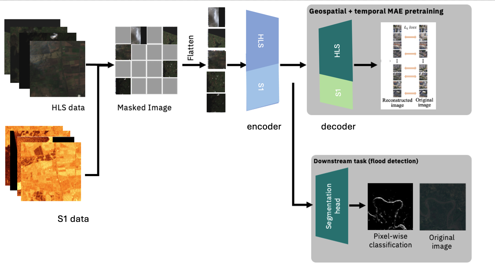

# Model Card for granite-geospatial-uki

The granite-geospatial-uki model is a transformer-based geospatial foundation model trained on HLS L30 multispectral satellite imagery and Sentinel-1 synthetic aperture radar (SAR) backscatter over the United Kingdom and Ireland. The model consists of a self-supervised encoder developed with a ViT architecture and Masked AutoEncoder (MAE) learning strategy, with an MSE loss function and follows the same architecture as [Prithvi-EO](https://huggingface.co/collections/ibm-nasa-geospatial/prithvi-for-earth-observation-6740a7a81883466bf41d93d6).

<figure>
    
    <figcaption>granite-geospatial-uki schematic
    </figcaption>
</figure>

## How to Get Started with the Model 

An example of fine-tuning the model for image segmentation using Terratorch for flood detection in the UK and Ireland can be found [here](./notebooks/2_fine_tuning.ipynb).

## Pre-training 

The granite-geospatial-uki model uses the [Prithvi-EO](https://huggingface.co/collections/ibm-nasa-geospatial/prithvi-for-earth-observation-6740a7a81883466bf41d93d6) model architecture. It was pre-trained starting from initial model weights which were pre-trained from data that covered the continental USA and did not include SAR data, then an additional pre-training was applied using 16,000 HLS L30 and Sentinel-1 images which cover the United Kingdom and Ireland. The Sentinel-1 SAR backscatter ($\sigma_0$) were resampled to the same resolution as the HLS data, and were normalized by $10log(\sigma_0)$, where pixels with $10log(\sigma_0) > 10$  are set to 10 and $10log(\sigma_0) < -35$ are set to -35. The two additional Sentinel-1 bands were initialized with the mean weights of the other channels for pre-training. The following bands were used in the pre-trained model:

- Blue
- Green
- Red
- Narrow NIR
- SWIR 1
- SWIR 2 
- VV
- VH

##  Model Card Authors 
Geoffrey Dawson, Chris Dearden, Andrew Taylor, Helen Tamura-Wicks, Anne Jones & Paolo Fraccaro.

## Acknowledgments
This work was supported by the Hartree National Centre for Digital Innovation, a collaboration between STFC and IBM.

## IBM Public Repository Disclosure: 	
All content in this repository including code has been provided by IBM under the associated open source software license and IBM is under no obligation to provide enhancements, updates, or support. IBM developers produced this code as an open source project (not as an IBM product), and IBM makes no assertions as to the level of quality nor security, and will not be maintaining this code going forward.
